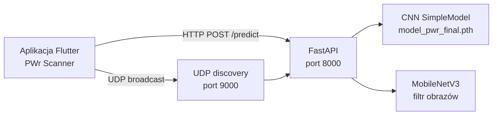

# RiPO — PWr Building Scanner

Projekt z przedmiotu **Rozpoznawanie i Przetwarzanie Obrazów (RiPO)** — system rozpoznawania budynków Politechniki Wrocławskiej na podstawie zdjęć. Składa się z modelu CNN (PyTorch), serwera API (FastAPI) oraz aplikacji mobilnej (Flutter).

## Funkcjonalność

- **Klasyfikacja 10 budynków** kampusu PWr na zdjęciu z aparatu, galerii lub trybu skanera na żywo.
- **Filtrowanie obrazów spoza domeny** — wstępna weryfikacja przez MobileNetV3 (ImageNet), odrzucenie m.in. pojazdów, zwierząt i ludzi.
- **Próg pewności** — wynik poniżej 60% zwraca status „Nie rozpoznano”.
- **Automatyczne wykrywanie serwera** — broadcast UDP (`GDZIE_JEST_SERWER_PWR` → odpowiedź z adresem IP).
- **Zgłaszanie błędów** — użytkownik może wysłać zdjęcie z błędną predykcją na serwer.

## Rozpoznawane budynki

| Etykieta modelu | Folder w `dataset/` / `val/` |
|-----------------|------------------------------|
| A-1 | `A1` |
| C-1 | `C1` |
| C-13 (Serowiec) | `C13` |
| C-16 | `C16` |
| C-18 | `C18` |
| C-3/4 | `C3-4` |
| C-7 | `C7` |
| D-1 | `D1` |
| D-20 | `D20` |
| H-6 | `H6` |

## Architektura



## Struktura repozytorium

```
ripo_proj1/
├── README.md                 # ten plik
├── venv/                     # opcjonalne środowisko Python (lokalne)
└── RiPO/
    ├── requirements.txt
    ├── src/                  # backend ML i serwer
    │   ├── Model.py          # trening modelu
    │   ├── server.py         # API inferencji
    │   ├── test_results.py   # macierz pomyłek, metryki
    │   ├── dataSetToVal.py   # podział dataset → val
    │   ├── video_to_photo.py # klatki z wideo do zbioru
    │   ├── czy-widzi-cuda.py # sprawdzenie CUDA
    │   ├── dataset/          # zdjęcia treningowe (klasy = podfoldery)
    │   ├── val/              # zdjęcia walidacyjne
    │   └── model_pwr_final.pth  # wagi do serwera (lokalnie)
    ├── app/app_ripo/         # aplikacja Flutter
    │   └── lib/main.dart
    └── sprawozdania_oraz_opisy-etapow/
        ├── Etap1/
        └── Etap2/
```

## Wymagania

| Komponent | Wersja / uwagi |
|-----------|----------------|
| Python | 3.11+ (zalecane) |
| PyTorch | z CUDA opcjonalnie (szybszy trening i inferencja) |
| Flutter SDK | zgodny z `sdk: ^3.11.4` w `pubspec.yaml` |
| Urządzenie mobilne | Android / iOS, ta sama sieć Wi-Fi co serwer |

## Instalacja — backend (Python)

Z katalogu głównego workspace:

```powershell
cd d:\DANE\studia\sem6\RIPO\ripo_proj1
python -m venv venv
.\venv\Scripts\Activate.ps1
pip install -r RiPO\requirements.txt
pip install pillow python-multipart scikit-learn seaborn
```

> `pillow` i `python-multipart` są potrzebne do serwera (`PIL`, upload plików). `scikit-learn` i `seaborn` — tylko do `test_results.py`.

Sprawdzenie GPU:

```powershell
cd RiPO\src
python czy-widzi-cuda.py
```

## Uruchomienie serwera

Serwer musi mieć w katalogu `RiPO/src/` plik wag `model_pwr_final.pth` (po treningu lub skopiowany z repozytorium zespołu).

```powershell
cd RiPO\src
python server.py
```

- API: `http://<IP-komputera>:8000`
- Dokumentacja OpenAPI: `http://<IP>:8000/docs`
- UDP discovery: port **9000** (aplikacja wysyła broadcast i odbiera IP serwera)

Upewnij się, że firewall zezwala na porty **8000** i **9000**, a telefon jest w tej samej sieci co komputer z serwerem.

### Endpointy API

| Metoda | Ścieżka | Opis |
|--------|---------|------|
| `POST` | `/predict` | Plik obrazu (`file`) → JSON: `budynek`, `pewnosc`, `wydzial` |
| `POST` | `/report` | Zapis błędnego zdjęcia do `raporty_od_uzytkownikow/` |

Przykładowa odpowiedź sukcesu:

```json
{
  "budynek": "C-13 (Serowiec)",
  "pewnosc": 87.42,
  "wydzial": "pyszny ser"
}
```

## Instalacja i uruchomienie — aplikacja Flutter

```powershell
cd RiPO\app\app_ripo
flutter pub get
flutter run
```

Na urządzeniu fizycznym podłączonym przez USB wybierz odpowiedni target (`flutter devices`). Jeśli automatyczne wykrycie IP nie zadziała, na ekranie głównym wyświetlane jest aktualne IP serwera — można je ręcznie ustawić w kodzie (`_serverIP` w `main.dart`) lub poprawić konfigurację sieci.

Tryby w aplikacji:

- **Skaner** — podgląd kamery z okresową inferencją,
- **Aparat** / **Galeria** — pojedyncze zdjęcie,
- **Zgłoś błąd** — wysyłka zdjęcia na `/report`.

## Trening modelu

1. Umieść zdjęcia w `RiPO/src/dataset/<klasa>/` (nazwy folderów jak w tabeli powyżej).
2. Opcjonalnie przygotuj zbiór walidacyjny w `RiPO/src/val/` (np. skrypt `dataSetToVal.py` lub ręczny podział).
3. Uruchom trening:

```powershell
cd RiPO\src
python Model.py
```

Po zakończeniu powstaną pliki:

- `model_pwr_best.pth` — najlepsza dokładność na walidacji,
- `model_pwr_final.pth` — wagi z ostatniej epoki (używane przez `server.py`).

Parametry treningu (domyślnie): 30 epok, batch 128, augmentacja (obrót, perspektywa, `ColorJitter`), `Adam` z `ReduceLROnPlateau`.

## Ewaluacja

```powershell
cd RiPO\src
python test_results.py
```

Generuje m.in. macierz pomyłek (`macierz_pomylek.png`) i raport klasyfikacji na zbiorze `val/`.

## Pomocnicze skrypty

| Plik | Zastosowanie |
|------|----------------|
| `video_to_photo.py` | Ekstrakcja klatek z nagrań wideo do `dataset` / `val` |
| `dataSetToVal.py` | Przygotowanie podziału trening / walidacja |
| `czy-widzi-cuda.py` | Informacja o karcie graficznej i VRAM |

## Dokumentacja projektu

Sprawozdania i opisy etapów znajdują się w:

- `RiPO/sprawozdania_oraz_opisy-etapow/Etap1/`
- `RiPO/sprawozdania_oraz_opisy-etapow/Etap2/`

## Uwagi

- Pliki `*.pth`, zdjęcia i filmy są w `.gitignore` — po sklonowaniu repozytorium trzeba dostarczyć wagi modelu i/lub wytrenować je lokalnie.
- Zbiór `dataset/` może być duży; nie commituj go, jeśli nie jest to wymagane przez prowadzącego.
- Informacje o wydziałach w `server.py` (`BUILDING_INFO`) są przykładowe — można je uzupełnić o faktyczne dane kampusu.

## Technologie

- **PyTorch**, **torchvision** — CNN + MobileNetV3
- **FastAPI**, **Uvicorn** — serwer HTTP
- **OpenCV** — przetwarzanie wideo (skrypty pomocnicze)
- **Flutter** — `camera`, `image_picker`, `http`
